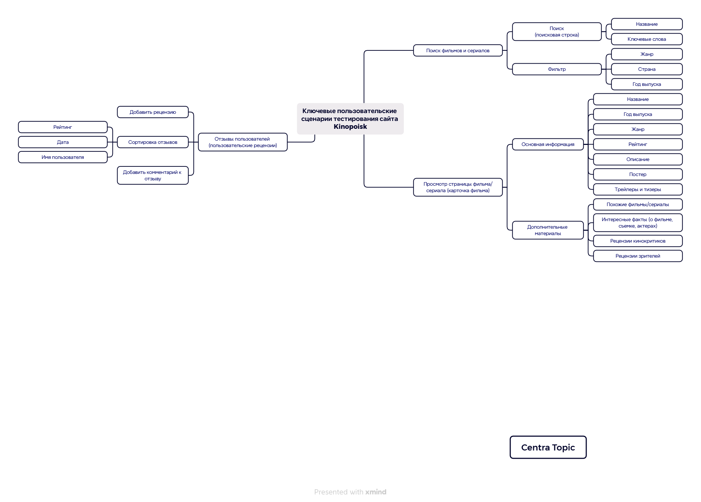

# Final-work-testing-the-Kinopoisk[README Кинопоиск.md](https://github.com/user-attachments/files/22565411/README.md)
# <a name="up" />Финальный проект - тестирование сайта  [Кинопоиск](https://www.kinopoisk.ru/)

Кинопоиск - это комплексная платформа, которая сочетает в себе:  
•	Базу данных о фильмах и сериалах   
•	Онлайн-кинотеатр   
•	Медиаплатформу с новостями и рецензиями   
•	Социальные функции для пользователей   
•	Сервис по продаже билетов в кино   

Цель моего проекта - провести комплексное тестирование ключевых функциональностей сайта и оценить качество пользовательского опыта.

# ТЕСТ-ПЛАН

## 1. Продукт – сайт [Кинопоиск](https://www.kinopoisk.ru/)

**Кинопоиск** — это комплексный русскоязычный онлайн-сервис о кинематографе, который сочетает в себе несколько ключевых продуктов:

- **База данных о фильмах и сериалах**: Обширная энциклопедия с информацией о фильмах, актерах, режиссерах и других деятелях киноиндустрии.
- **Онлайн-кинотеатр**: С 2018 года сервис предоставляет возможность просмотра фильмов и сериалов по подписке (через «Яндекс.Плюс») или разовой оплате.
- **Медиаплатформа**: Публикует новости, рецензии, интервью, статьи и тематические коллекции от редакции и привлеченных экспертов.
- **Социальный пласт платформы**: Позволяет пользователям создавать профили, ставить оценки, писать рецензии, составлять списки просмотренных и желаемых к просмотру фильмов, а также взаимодействовать друг с другом.
- **Сервис по продаже билетов**: Интегрирован с кинотеатрами, позволяя покупать билеты на сеансы.

## 2. Разделы и элементы

**Раздел: Функциональное ядро платформы:**

**Поиск фильмов и сериалов → Просмотр страницы фильма/сериала (карточка фильма) → Отзывы пользователей о фильме/сериале (пользовательские рецензии и оценки)**

Для тестирования ключевых пользовательских сценариев выделяем три взаимосвязанных раздела, образующих основное путешествие пользователя на сайте:

### 1. Поиск фильмов и сериалов
- **Быстрый поиск** с автодополнением и исправлением опечаток
- **Расширенная фильтрация** по жанрам, годам, рейтингам, странам
- **Сортировка результатов** по релевантности, дате, рейтингу

### 2. Карточка фильма/сериала
- **Полная информация** о контенте (описание, актеры, режиссер, рейтинги)
- **Медиаконтент** - трейлеры, кадры, постеры
- **Кнопки действий** ("Смотреть", "Буду смотреть", "Трейлер")
- **Навигация** между разделами карточки

### 3. Пользовательские рецензии и оценки
- **Система оценок** (10-балльная шкала)
- **Возможность написания рецензий** с форматированием
- **Модерация контента** и блокировка спойлеров
- **Система голосования** за полезность отзывов
- **Сортировка отзывов** по дате, полезности, рейтингу

## Оглавление

## [Интеллект-карта](#mind-map)
## [Основные требования](#requirements)
## [Сроки выполнения тестирования](#testing-schedule)
## [Виды тестирования](#testing-types)
- **Smoke тестирование**
- **Функциональное тестирование** 
- **UI/UX тестирование**
- **Кросс-браузерное тестирование**
- **API тестирование**
- **Тестирование безопасности**
## [Инструменты тестирования](#testing-tools)
## [Потенциальные риски](#risks)
## [Критерии начала тестирования](#start-criteria)
## [Критерии приемки тестирования](#acceptance-criteria)
## [Баг-репорты](#bug-reports)
## [Отчет о тестировании готового проекта](#test-report)


## <a name="интеллект-карта" />Интеллект-карта
### Ключевые элементы интеллект-карты:
**1. Поиск фильмов и сериалов:**
- Поисковая строка с автодополнением
- Фильтры по жанру, стране, году выпуска
- Сортировка результатов

**2. Просмотр страницы фильма (карточка фильма):**
- Основная информация (название, год, жанр, рейтинг)
- Постеры и трейлеры
- Описание и интересные факты

**3. Отзывы пользователей (рецензии):**
- Система оценок (10-балльная шкала)
- Добавление рецензий
- Сортировка отзывов по дате и рейтингу



## <a name="основные-требования" />Основные требования

### Основные функциональные требования к тестируемому сценарию:

#### 1. Интеллектуальный поиск фильмов/сериалов и фильтрация контента

Это стартовая точка пользовательского опыта. Раздел предназначен для быстрого и точного нахождения фильмов и сериалов в обширной базе данных Кинопоиска.

**Цель раздела:** Предоставить пользователю максимально релевантные результаты по его запросу, минимизируя время и усилия на поиск.

**Ключевые элементы для тестирования:**

- **Умная система поиска и навигации:** Автодополнение при вводе запроса, исправление опечаток, поиск не только по названиям, но и по именам актеров, режиссеров, ключевым словам из сюжета.

- **Система расширенной фильтрации:** Многоуровневые фильтры по жанру, году выпуска, стране, рейтингу, наличию подписки или бесплатного просмотра, наградам (Оскар и др.).

- **Сортировка результатов:** По релевантности, рейтингу, дате выхода, алфавиту, количеству оценок.

#### 2. Карточка фильма / сериала

Центральный раздел, агрегирующий всю информацию о кинопроизведении. Это комплексная страница, предназначенная для принятия финального решения о просмотре.

**Цель раздела:** Предоставить исчерпывающую информацию о фильме/сериале, заинтересовать пользователя и предоставить ему инструменты для взаимодействия (оценка, просмотр, чтение рецензий).

**Ключевые элементы для тестирования:**

- **Блок с основной информацией:** Постер, название (оригинальное и локализованное), рейтинг Кинопоиска, кнопки призыва к действию ("Смотреть", "Буду смотреть", "Трейлер", "Купить билет").

- **Детальная информация:** Оригинальное название, год, страна, жанр, возрастное ограничение, длительность (для сериалов — количество сезонов и серий).

- **Сюжет (синопсис):** Полное и краткое описание, возможность развернуть/свернуть текст.

- **Актерский состав и съемочная группа:** Интерактивные списки с фотографиями, ссылками на персоны и указанием ролей.

#### 3. Пользовательские рецензии и оценки

Это социальный пласт раздела, где пользователи делятся мнениями, формируя общую оценку и репутацию кинопроизведения.

**Цель раздела:** Создать пространство для дискуссии, помочь пользователям составить мнение на основе оценок и рецензий других зрителей.

**Ключевые элементы для тестирования:**

- **Система рейтингов (оценок):** Отображение среднего балла от зрителей и критиков, распределение оценок по "звездной" шкале (10-бальная система).

- **Блок рецензий:** Список рецензий с возможностью сортировки (по дате, полезности, рейтингу).

- **Интерактивность с отзывами:** Кнопки "Полезно"/"Не полезно" для рецензий, возможность оставлять комментарии к ним, жаловаться на спам или нарушения.

- **Форма написания собственной рецензии:** Доступность после просмотра (или подтверждения просмотра), работа текстового редактора (жирный шрифт, курсив, спойлеры), предпросмотр перед публикацией.

- **Модерация:** Отображение статуса рецензии (опубликована, на модерации, отклонена), соблюдение правил платформы.

Этот структурированный подход позволяет системно протестировать не только отдельные функции, но и их интеграцию друг с другом, обеспечивая бесшовный и удобный пользовательский опыт.

## <a name="сроки-выполнения-тестирования" />Сроки выполнения тестирования

### План-график проведения тестирования

| Вид тестирования | Дата проведения тестирования | Ответственный исполнитель | Основные инструменты |
|------------------|-------------------------------|---------------------------|---------------------|
| **Smoke тестирование** | 01.09.2025 – 20.09.2025 | Локтева Н.В. | Ручное тестирование, браузеры |
| **Функциональное тестирование** | 01.09.2025 – 20.09.2025 | Локтева Н.В. | Ручное тестирование, TestIT |
| **UI/UX тестирование** | 01.09.2025 – 20.09.2025 | Локтева Н.В. | Браузеры, DevTools |
| **Кросс-браузерное тестирование** | 01.09.2025 – 20.09.2025 | Локтева Н.В. | Yandex, Edge, 360 Extreme Browser |
| **API тестирование** | 21.09.2025 – 30.09.2025 | Локтева Н.В. | Postman, Swagger |
| **Тестирование безопасности API** | 21.09.2025 – 30.09.2025 | Локтева Н.В. | **Postman (работа с токенами)** |

### Детальное описание этапов тестирования

#### 🔍 Первый этап (01.09.2025 – 20.09.2025)
**Фокус на пользовательском интерфейсе и основной функциональности:**

- **Smoke тестирование** - проверка критически важных функций на стабильность
- **Функциональное тестирование** - детальная проверка всех функций
- **UI/UX тестирование** - оценка удобства интерфейса и пользовательского опыта
- **Кросс-браузерное тестирование** - обеспечение совместимости с различными браузерами

#### 🔧 Второй этап (21.09.2025 – 30.09.2025)
**Фокус на технической составляющей и безопасности API:**

- **API тестирование** - проверка работы backend-сервисов и интеграций
- **Тестирование безопасности API** - **работа с аутентификацией и авторизацией через токены в Postman**

### Тестирование безопасности API: Конкретные задачи

В рамках тестирования безопасности с использованием Postman выполнены следующие проверки:

#### ✅ Проверка аутентификации:
- Тестирование валидных и невалидных API-ключей
- Проверка работы токенов авторизации
- Тестирование сроков жизни токенов
- Проверка обработки запросов без авторизации

#### ✅ Проверка авторизации:
- Тестирование доступа к endpoints с разными уровнями прав
- Проверка валидации параметров запросов
- Тестирование обработки некорректных данных

#### ✅ Примеры тестовых сценариев в Postman:
```javascript
// Проверка валидного токена
pm.test("Valid token returns 200", function () {
    pm.response.to.have.status(200);
});

// Проверка невалидного токена
pm.test("Invalid token returns 401", function () {
    pm.response.to.have.status(401);
});

// Проверка отсутствия токена
pm.test("Missing token returns 401", function () {
    pm.response.to.have.status(401);
});
